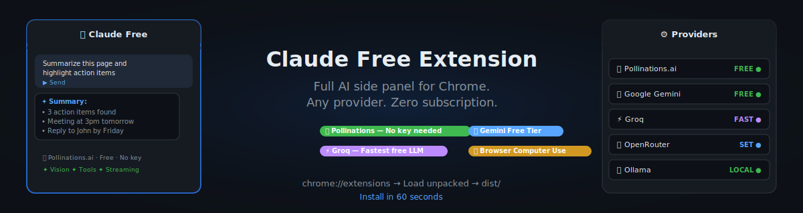
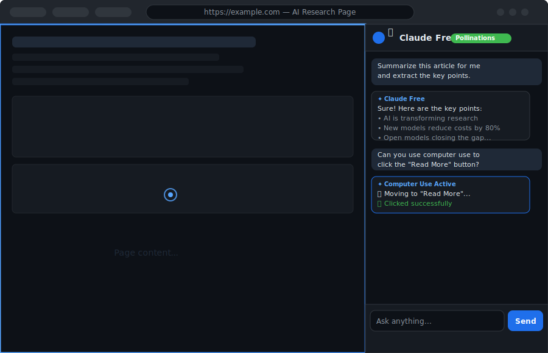
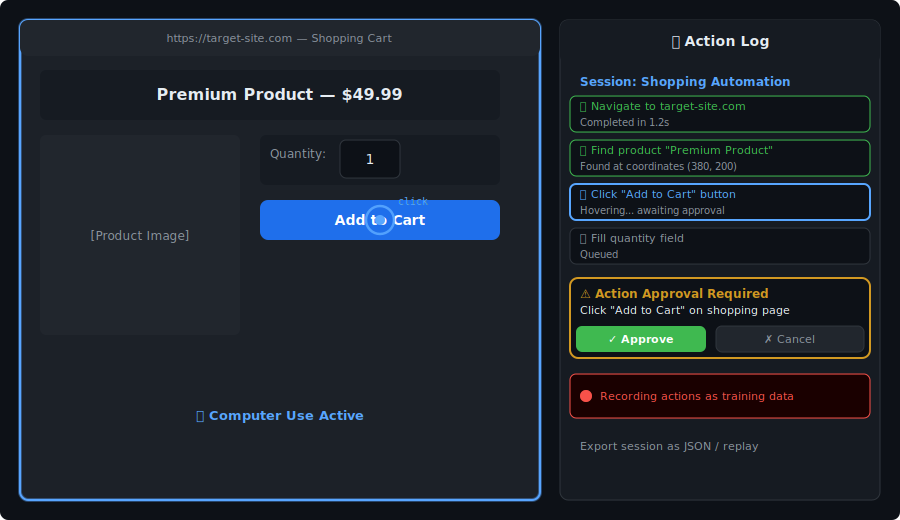

<div align="center">

# 🤖 Claude Free Extension

> A Chrome side panel powered by **any free AI provider** — Gemini, DeepSeek, Groq, OpenRouter, Ollama and more. Full browser computer use included. No Claude subscription required.

[](https://github.com/staimoorulhassan/Claude-Free-Extension/releases/tag/v3.2.1)
[](https://www.typescriptlang.org/)
[](https://developer.chrome.com/docs/extensions/mv3/)
[](https://github.com/staimoorulhassan/Claude-Free-Extension)
[](https://github.com/staimoorulhassan/Claude-Free-Extension/commits)

**The Claude chat experience — for free, in your browser, with any AI provider.**

[🚀 Install in 60 seconds](#-quick-start) · [🎯 Supported Providers](#-supported-providers) · [🖥️ Computer Use](#️-browser-computer-use) · [📦 Releases](https://github.com/staimoorulhassan/Claude-Free-Extension/releases)



</div>

---

## ✨ What is Claude Free Extension?

Claude Free Extension is a **Chrome side panel** that gives you a full-featured AI assistant on any webpage — without paying for a Claude subscription. It translates between Anthropic's message format and OpenAI-compatible APIs so you can plug in **Gemini, DeepSeek, Groq, Ollama, OpenRouter** (and 8 more providers) with zero code changes.

Unlike other AI extensions, it ships with **browser computer use** — the AI can literally see your screen, move the cursor, click buttons, fill forms, and navigate pages in real time using the Chrome DevTools Protocol.

---

## 🚀 Quick Start

> **No build step needed.** The `dist/` folder is pre-compiled and committed.

### Install (60 seconds)

1. **Download** — clone or [download the zip](https://github.com/staimoorulhassan/Claude-Free-Extension/archive/refs/heads/main.zip) and unzip
2. **Open Chrome** → go to `chrome://extensions`
3. **Enable Developer Mode** (toggle in top-right)
4. **Click "Load unpacked"** → select the `dist/` folder
5. **Click the puzzle icon** in Chrome toolbar → pin "Claude Free"
6. **Open any webpage** → press `Ctrl+E` (or `Cmd+E` on Mac) to open the panel

**Zero API key required to start** — the default provider (Pollinations.ai) works immediately with no signup.

### Optional: build from source

```bash
git clone https://github.com/staimoorulhassan/Claude-Free-Extension.git
cd Claude-Free-Extension
npm install
npm run build
# Then load the dist/ folder as described above
```

---

## 🎯 Supported Providers

Swap AI providers anytime in Settings — each provider's API key is stored separately, encrypted locally, and never sent anywhere except the chosen provider.

| Provider | Free Tier | Vision | Tools | Notes |
|---|---|---|---|---|
| **Pollinations.ai** | ✅ No key needed | ✅ | ✅ | **Default — zero setup** |
| **Google Gemini** | ✅ Generous free quota | ✅ | ✅ | [aistudio.google.com](https://aistudio.google.com) |
| **DeepSeek** | ✅ Very cheap | ❌ | ✅ | [platform.deepseek.com](https://platform.deepseek.com) |
| **Alibaba Qwen** | ✅ Free tier | ✅ | ✅ | dashscope-intl.aliyuncs.com |
| **OpenAI** | ❌ Paid | ✅ | ✅ | [platform.openai.com](https://platform.openai.com) |
| **OpenRouter** | ✅ Free models available | ✅ | ✅ | [openrouter.ai](https://openrouter.ai) |
| **Fireworks AI** | ✅ Free credits | ✅ | ✅ | [fireworks.ai](https://fireworks.ai) |
| **Groq** | ✅ Fast & free | ❌ | ✅ | [console.groq.com](https://console.groq.com) |
| **Mistral** | ✅ Free tier | ✅ | ✅ | [console.mistral.ai](https://console.mistral.ai) |
| **Kimi (Moonshot)** | ✅ Free credits | ✅ | ✅ | [platform.moonshot.cn](https://platform.moonshot.cn) |
| **Ollama** | ✅ Fully local | ✅ | ✅ | No key, runs on your machine |
| **LM Studio** | ✅ Fully local | ❌ | ✅ | No key, runs on your machine |

---

## 📸 Screenshots

<div align="center">

| Chat Panel | Provider Settings |
|---|---|
|  |  |



> **These are design mockups.** See [docs/screenshots/SCREENSHOT-GUIDE.md](docs/screenshots/SCREENSHOT-GUIDE.md) for instructions on taking real screenshots and recording a GIF demo.

</div>

---

## 🖥️ Browser Computer Use

The AI can **see and control your browser** in real time:

- 👁️ **Screenshot capture** — AI takes a screenshot and interprets what's on screen
- 🖱️ **Click, type, scroll** — actions are injected via Chrome DevTools Protocol (trusted, native-quality input)
- 🔵 **Blue glow indicator** — a pulsing electric-blue border appears around the tab and a phantom cursor follows every agent action so you always know when automation is running
- ✅ **Pre-action approval** — review and confirm each action before it fires
- 🥷 **Steel stealth browser** — routes automation through a Steel browser session to bypass bot detection and solve CAPTCHAs automatically
- 📹 **Action recording** — record sequences as training data and replay them

---

## ✨ Features

| Category | What you get |
|---|---|
| **AI Chat** | Streaming responses, full markdown (GFM + LaTeX + syntax highlight), tool use / function calling |
| **Vision** | Paste screenshots, attach images; base64 and URL both work |
| **Memory** | Conversation history persisted across sessions in `chrome.storage.local` |
| **UX** | Dark / light / auto theme, `Ctrl+E` toggle, quick-prompt chips on empty state |
| **Performance** | Token optimizer auto-detects query type (direct / code / detailed) and adjusts response style |
| **Security** | Per-provider API key vault — keys encrypted locally, never synced |

---

## 🏗️ Architecture

```
src/
├── background.ts          # Service worker — routing, provider adapter, computer-use orchestration
├── content.ts             # Content script — page interaction, screenshot capture
├── visual-indicator.ts    # Blue glow border + phantom cursor during automation
├── sidepanel/             # React side panel UI (chat, settings, history)
├── options/               # Extension options page
└── lib/                   # Provider adapters (Anthropic ↔ OpenAI format translation)

accessibility-tree.js      # Injected into MAIN world for native-quality DOM interaction
```

The built-in **Anthropic↔OpenAI adapter** (`src/lib/`) is what makes all 12 providers work transparently — the rest of the codebase only speaks Anthropic message format.

---

## 🔧 Development

```bash
npm run dev        # Watch mode — rebuilds dist/ on every save
npm run build      # Production build
npm run type-check # TypeScript check (no emit)
```

After any build, **reload the extension** in `chrome://extensions` (click the ↻ icon on the extension card).

---

## 🤝 Contributing

Contributions are welcome!

1. Fork the repo
2. Create a branch: `git checkout -b feat/your-feature`
3. Make your changes and rebuild: `npm run build`
4. Open a Pull Request

Good first contributions:
- Adding a new provider (copy an existing adapter in `src/lib/`)
- UI improvements to the side panel
- Improving the accessibility tree parser

Good first issues are labeled [`good first issue`](https://github.com/staimoorulhassan/Claude-Free-Extension/issues?q=label%3A%22good+first+issue%22).

---

## 📋 Changelog

| Version | Highlights |
|---|---|
| **v3.2.1** | Blue glow border + phantom cursor during computer use |
| **v3.2.0** | Visual redesign, Steel stealth browser, per-provider API vault, action recording |
| **v3.0.1** | Build fix for fresh clones (`accessibility-tree.js` committed) |

Full changelog → [Releases](https://github.com/staimoorulhassan/Claude-Free-Extension/releases)

---

## ⚠️ License

This repository currently has **no license**. Until one is added, standard copyright law applies — no one may copy, distribute, or modify this code without explicit permission. Consider adding an [MIT License](https://choosealicense.com/licenses/mit/) to make it officially open source.

---

<div align="center">

Built by [staimoorulhassan](https://github.com/staimoorulhassan) · [Live Site](https://claude-free-extension.vercel.app)

⭐ **Star this repo** if it saved you money on AI subscriptions!

**Suggested GitHub Topics** (add these for discoverability):
`chrome-extension` `ai-assistant` `browser-extension` `computer-use` `openrouter` `gemini` `free-ai` `side-panel` `typescript` `anthropic`

</div>
