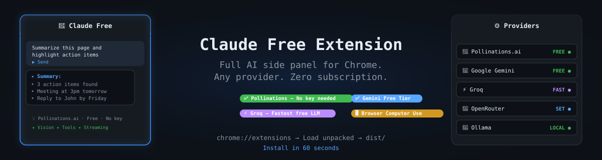
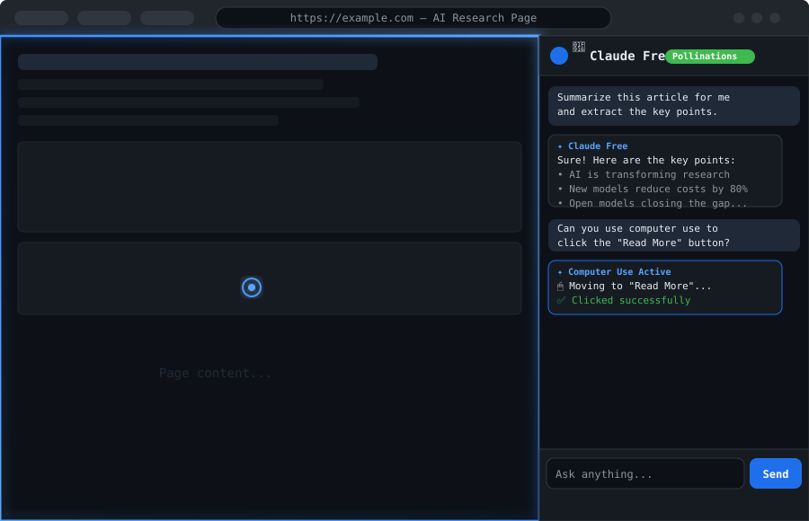
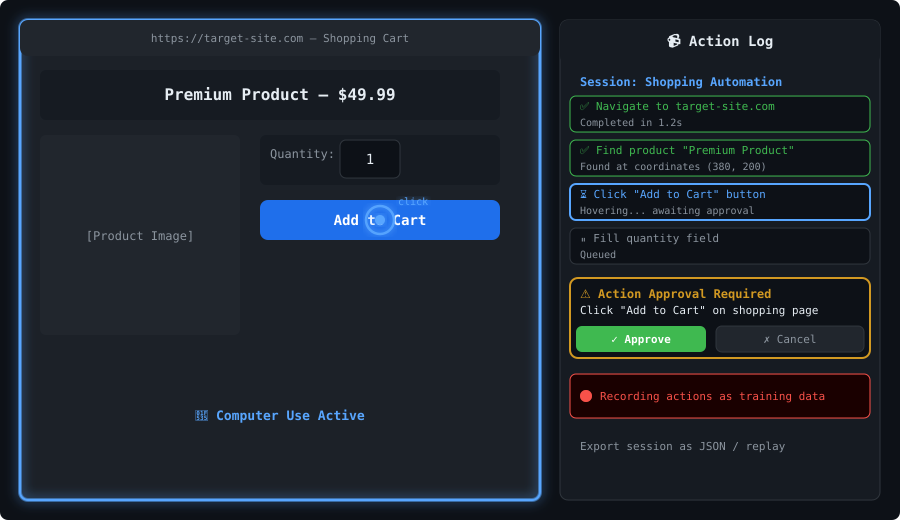

<div align="center">

# 🤖 Claude Free Extension — Free AI Browser Assistant with Computer Use

> A **free AI browser assistant** and Chrome side panel powered by **any free AI provider** — Gemini, DeepSeek, Groq, OpenRouter, Ollama and more. Full **browser automation** and computer use included. No Claude subscription required. Open-source, privacy-first, works offline with local models.

[](https://github.com/staimoorulhassan/Claude-Free-Extension/releases)
[](https://www.typescriptlang.org/)
[](https://developer.chrome.com/docs/extensions/mv3/)
[](https://github.com/staimoorulhassan/Claude-Free-Extension)
[](https://github.com/staimoorulhassan/Claude-Free-Extension/commits)
[](https://github.com/staimoorulhassan/Claude-Free-Extension/actions/workflows/build.yml)

**The Claude chat experience — for free, in your browser, with any AI provider.**

[🚀 Install in 60 seconds](#-quick-start) · [🎯 Supported Providers](#-supported-providers) · [🖥️ Computer Use](#️-browser-computer-use) · [✨ Features](#-features) · [🏗️ Architecture](#️-architecture) · [📋 Changelog](#-changelog) · [🤝 Contributing](#-contributing) · [📦 Releases](https://github.com/staimoorulhassan/Claude-Free-Extension/releases)



</div>

---

## ✨ What is Claude Free Extension?

Claude Free Extension is a **free AI browser assistant** and Chrome side panel that gives you a full-featured AI coding assistant on any webpage — without paying for a Claude subscription. It translates between Anthropic's message format and OpenAI-compatible APIs so you can plug in **Gemini, DeepSeek, Groq, Ollama, OpenRouter** — 16 built-in provider presets in total — with zero code changes.

Unlike other AI browser extensions, it ships with **browser automation and computer use** — the AI can literally see your screen, move the cursor, click buttons, fill forms, and navigate pages in real time using the Chrome DevTools Protocol. Voice input lets you talk to the assistant, and group confinement keeps automated work isolated from your browsing.

---

## 🚀 Quick Start

> **No build step needed.** The `dist/` folder is pre-compiled and committed.

### Install (60 seconds)

1. **Download** — grab **`claude-free-extension-vX.Y.Z.zip`** from the [latest release](https://github.com/staimoorulhassan/Claude-Free-Extension/releases/latest) and unzip it. (This zip is the pre-built extension — no source, no npm.)
2. **Open Chrome** → go to `chrome://extensions`
3. **Enable Developer Mode** (toggle in top-right)
4. **Click "Load unpacked"** → select the unzipped folder
5. **Click the puzzle icon** in Chrome toolbar → pin "Claude Free"
6. **Open any webpage** → press `Ctrl+E` (or `Cmd+E` on Mac) to open the panel

**Zero API key required to start** — the default provider (Pollinations.ai) works immediately with no signup.

### Optional: build from source

```bash
git clone https://github.com/staimoorulhassan/Claude-Free-Extension.git
cd Claude-Free-Extension
npm install
npm run build
# Then load the dist/ folder as described above
```

---

## 🎯 Supported Providers

Swap AI providers anytime in Settings — each provider's API key is stored separately, encrypted locally, and never sent anywhere except the chosen provider.

| Provider | Free Tier | Vision | Tools | Notes |
|---|---|---|---|---|
| **Pollinations.ai** | ✅ No key needed | ✅ | ✅ | **Default — zero setup** |
| **Google Gemini** | ✅ Generous free quota | ✅ | ✅ | [aistudio.google.com](https://aistudio.google.com) |
| **DeepSeek** | ✅ Very cheap | ❌ | ✅ | [platform.deepseek.com](https://platform.deepseek.com) |
| **Alibaba Qwen** | ✅ Free tier | ✅ | ✅ | dashscope-intl.aliyuncs.com |
| **OpenAI** | ❌ Paid | ✅ | ✅ | [platform.openai.com](https://platform.openai.com) |
| **OpenRouter** | ✅ Free models available | ✅ | ✅ | [openrouter.ai](https://openrouter.ai) |
| **Fireworks AI** | ✅ Free credits | ✅ | ✅ | [fireworks.ai](https://fireworks.ai) |
| **Groq** | ✅ Fast & free | ❌ | ✅ | [console.groq.com](https://console.groq.com) |
| **Mistral** | ✅ Free tier | ✅ | ✅ | [console.mistral.ai](https://console.mistral.ai) |
| **Kimi (Moonshot)** | ✅ Free credits | ✅ | ✅ | [platform.moonshot.cn](https://platform.moonshot.cn) |
| **Novarouter** | ✅ Free Claude Fable 5, lifetime | ✅ | ✅ | [novarouter.site](https://novarouter.site) — 1M context, no subscription |
| **Ollama** | ✅ Fully local | ✅ | ✅ | No key, runs on your machine |
| **LM Studio** | ✅ Fully local | ❌ | ✅ | No key, runs on your machine |

Each provider has an approximate **context window** used for automatic chat-history compression (Settings → Context window, overridable per-provider). Configuring a model with **Tools: ❌** (or any custom endpoint you mark as such) automatically falls back to a text-based `<tool_call>` protocol instead of native function calling, so browser automation still works — see `specs/001-claude-free-extension/contracts/messages.md` for the wire format.

---

## 📸 Screenshots

<div align="center">

| Chat Panel | Provider Settings |
|---|---|
|  |  |



> **These are design mockups.** See [docs/screenshots/SCREENSHOT-GUIDE.md](docs/screenshots/SCREENSHOT-GUIDE.md) for instructions on taking real screenshots and recording a GIF demo.

</div>

---

## 🖥️ Browser Computer Use

The AI can **see and control your browser** in real time:

- 👁️ **Screenshot capture** — AI takes a screenshot and interprets what's on screen
- 🖱️ **Click, type, scroll** — actions are injected via Chrome DevTools Protocol (trusted, native-quality input)
- 🔵 **Blue glow indicator** — a pulsing electric-blue border appears around the tab and a phantom cursor follows every agent action so you always know when automation is running
- ✅ **Pre-action approval** — review and confirm each action before it fires (always required for `execute_js`, regardless of your general approval setting)
- 🥷 **Steel stealth browser** — routes automation through a Steel browser session to bypass bot detection and solve CAPTCHAs automatically (note: the current Steel execution backend is a stub — see `specs/001-claude-free-extension/research.md` §10)
- 📹 **Action recording** — record sequences as training data and replay them
- 🩹 **Self-healing** — auto-dismisses cookie/consent overlays blocking a click target, then retries; falls back to asking you after two failed attempts on the same element
- 🗂️ **Tab groups** — opening the panel groups your current tab into a blue **"Claude Free"** group and every tab the agent opens joins it, so automated work stays visually isolated from your other browsing (never hijacks groups you made yourself). When no panel group exists, tasks fall back to task-scoped groups labeled `🤖 Agent: <task>`; "Terminate Task" closes exactly the tabs a task opened
- 💾 **Crash-resilient state** — task progress is journaled to `chrome.storage.local` after every round, so a service-worker restart mid-task doesn't lose your conversation
- 🔢 **Configurable tool-round cap** — the agent loop's max tool rounds (default 25) is a visible setting (`Settings → Max tool rounds`), so long tasks aren't hard-stopped at 25 rounds

**Tool actions available to the agent**: `navigate`, `read_page_state` (accessibility tree + console/network errors + optional screenshot), `click_element`, `type_text`, `type`, `key`, `scroll`, `execute_js`, `manage_tabs`, `ask_user`, plus the original coordinate-based `left_click`/`right_click`/`double_click`/`middle_click`/`left_click_drag`/`screenshot`/`wait`/`read_page`.

---

## ✨ Features

| Category | What you get |
|---|---|
| **AI Chat** | Streaming responses, full markdown (GFM + LaTeX + syntax highlight), tool use / function calling |
| **Vision** | Paste screenshots, attach images; base64 and URL both work |
| **Memory** | Conversation history persisted across sessions in `chrome.storage.local` |
| **UX** | Dark / light / auto theme, `Ctrl+E` toggle, quick-prompt chips on empty state |
| **Performance** | Token optimizer auto-detects query type (direct / code / detailed) and adjusts response style |
| **Security** | Per-provider API key vault — keys encrypted locally, never synced |

---

## 🏗️ Architecture

```
src/
├── background.ts          # Service worker — routing, provider adapter, computer-use orchestration
├── content.ts             # Content script — page interaction, screenshot capture
├── visual-indicator.ts    # Blue glow border + phantom cursor during automation
├── sidepanel/             # React side panel UI (chat, settings, history)
├── options/               # Extension options page
└── lib/                   # Provider adapters (Anthropic ↔ OpenAI format translation)

accessibility-tree.js      # Injected into MAIN world for native-quality DOM interaction
```

The built-in **Anthropic↔OpenAI adapter** (`src/lib/`) is what makes all 16 provider presets work transparently — the rest of the codebase only speaks Anthropic message format.

---

## 🔧 Development

```bash
npm run dev        # Watch mode — rebuilds dist/ on every save
npm run build      # Production build
npm run type-check # TypeScript check (no emit)
```

After any build, **reload the extension** in `chrome://extensions` (click the ↻ icon on the extension card).

---

## 🤝 Contributing

Contributions are welcome!

1. Fork the repo
2. Create a branch: `git checkout -b feat/your-feature`
3. Make your changes and rebuild: `npm run build`
4. Open a Pull Request

Good first contributions:
- Adding a new provider (copy an existing adapter in `src/lib/`)
- UI improvements to the side panel
- Improving the accessibility tree parser

Good first issues are labeled [`good first issue`](https://github.com/staimoorulhassan/Claude-Free-Extension/issues?q=label%3A%22good+first+issue%22).

---

## 📋 Changelog

| Version | Highlights |
|---|---|
| **v3.6.0** | Voice input — a mic button in the composer transcribes speech into the message box via the Web Speech API (speech-to-text only); new `Voice input language` setting (BCP-47, default en-US) in the sidepanel and options |
| **v3.5.1** | Fix web_search — the DuckDuckGo results fetch was blocked by the extension CSP (`html.duckduckgo.com` added to `connect-src`) |
| **v3.5.0** | Group confinement — the extension only works inside its "Claude Free" tab group: selecting a tab outside the group hides the extension (panel closes, agent stops) and closing the group shuts it down; the computer tool refuses to act on any tab outside the group, so the agent never sees what happens outside it |
| **v3.4.1** | Structured planning flow — the agent plans first and asks MCQ-style clarifying questions (with a self-write option) before executing; long-running task support — configurable task timeout (0–120 min), cross-session memory persistence, and step/total progress reporting; plus a fix that keeps the agent loop running past tool calls when the provider emits an `end_turn` stop reason |
| **v3.4.0** | Version change (no feature release) — the extension now reports 3.4.0 |
| **v3.3.10** | Novarouter provider preset with the free lifetime Claude Fable 5 (1M context, `billed: false` — no subscription), available to everyone in Settings; plus Boss mode — a visible toggle that switches the system prompt to the maximum-authority profile and turns the agent glow red while working |
| **v3.3.9** | Error-handling hardening — the agent loop fails fast on non-transient HTTP 4xx client errors (400/401/403/404) instead of retrying until the 10-minute timeout, with actionable messages for bad requests, bad keys, out-of-credits, and misconfigured models; plus WCAG 1.4.3 AA color-contrast fixes and landmark/heading structure across the side panel and options |
| **v3.3.8** | Panel-open tab grouping (current tab + agent tabs in one "Claude Free" group) and a configurable max tool rounds setting |
| **v3.3.7** | Tabi Router provider preset with wallet onboarding |
| **v3.3.6** | Opik LLM Gateway support via per-provider extra headers |
| **v3.2.1** | Blue glow border + phantom cursor during computer use |
| **v3.2.0** | Visual redesign, Steel stealth browser, per-provider API vault, action recording |
| **v3.0.1** | Build fix for fresh clones (`accessibility-tree.js` committed) |

Full changelog → [Releases](https://github.com/staimoorulhassan/Claude-Free-Extension/releases)

---

## ⚠️ License

This repository currently has **no license**. Until one is added, standard copyright law applies — no one may copy, distribute, or modify this code without explicit permission. Consider adding an [MIT License](https://choosealicense.com/licenses/mit/) to make it officially open source.

---

<div align="center">

Built by [staimoorulhassan](https://github.com/staimoorulhassan) · [Live Site](https://claude-free-extension.vercel.app)

⭐ **Star this repo** if it saved you money on AI subscriptions!

**Suggested GitHub Topics** (add these for discoverability):
`chrome-extension` `ai-assistant` `browser-extension` `computer-use` `openrouter` `gemini` `free-ai` `side-panel` `typescript` `anthropic`

</div>
